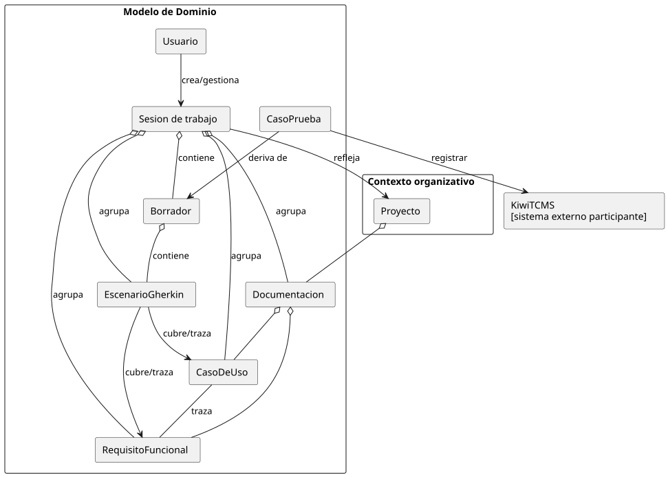
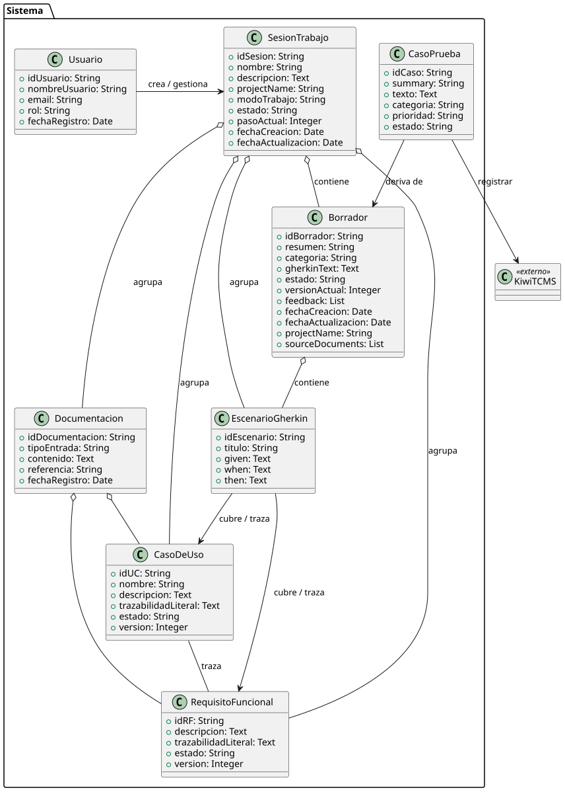
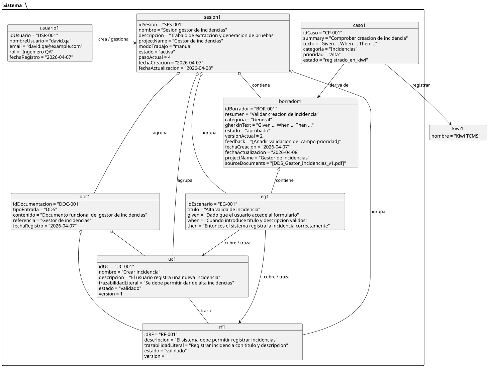
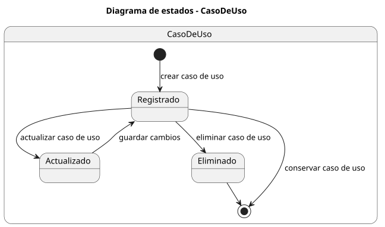
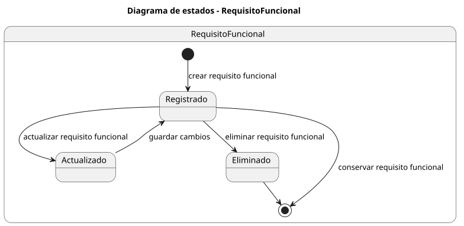
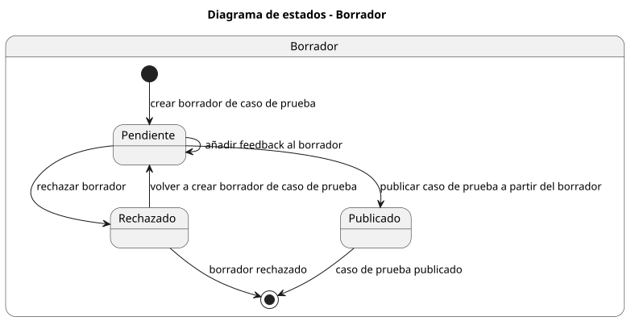

## Modelo de Dominio

  

#### Explicacion

# Modelo de Dominio

## Descripción general
En el contexto organizativo, el **Proyecto**, proporciona el contexto organizativo sobre el que se trabaja. Dentro del modelo de dominio aparece el **Usuario** en este caso el Ingeniero de QA, que crea y gestiona una **Sesión de trabajo**.

La **Sesión de trabajo** representa el contenedor funcional del flujo. Una unidad de trabajo que agrupa la documentación, los casos de uso, los requisitos funcionales, los escenarios Gherkin y el borrador generado para casos de prueba.

La **Documentación** constituye el punto de entrada del sistema y puede presentarse en forma de DRF o DDS. Cada documento queda asociado al proyecto y se incorpora a una sesión de trabajo concreta.

A partir de la documentación se obtienen **Casos de Uso** y **Requisitos Funcionales**, que representan la base funcional del conocimiento extraído. Entre ambos se mantiene una relación de trazabilidad, ya que describen de forma complementaria el comportamiento esperado del sistema.

Sobre esta base se generan **Escenarios Gherkin**, que formalizan el comportamiento en un formato estructurado y verificable. Dichos escenarios se integran en un **Borrador**, que constituye el artefacto interno de revisión. El borrador permite ser consultado, recibir feedback, ser rechazado o publicarse como caso de prueba en Kiwi TCMS.

Cuando un borrador es aceptado, el sistema deriva de él un **Caso de Prueba**, que representa el artefacto final del dominio. Este caso de prueba puede registrarse en **Kiwi TCMS**, que se modela como sistema externo participante. Kiwi TCMS no forma parte del núcleo del dominio, pero interviene en el flujo funcional global como repositorio externo de registro de casos de prueba.

De este modo, el modelo mantiene la trazabilidad completa desde el usuario y su sesión de trabajo hasta la documentación inicial, los artefactos derivados y el caso de prueba final, incluyendo la publicacion posterior en Kiwi TCMS.

## Diagrama de Clases

  

## Diagrama de Objetos

  

## Diagramas de Estado

### Estados de `CasoDeUso`

  

#### Explicacion

El `CasoDeUso` nace en `Registrado` cuando se crea dentro del sistema a partir de la documentacion funcional. Mientras permanece registrado puede consultarse, listarse y utilizarse como base para la trazabilidad con requisitos funcionales y escenarios Gherkin.

Si el usuario modifica su contenido, el caso de uso pasa temporalmente por `Actualizado` y vuelve a `Registrado` cuando los cambios quedan guardados. El otro posible final del ciclo es `Eliminado`, que representa la ejecucion del caso de uso de eliminacion cuando el caso de uso deja de ser necesario dentro de la sesion.

### Estados de `RequisitoFuncional`

  

#### Explicacion

El `RequisitoFuncional` sigue una evolucion equivalente a la del caso de uso. Nace en `Registrado` cuando se crea dentro de una sesion, normalmente asociado a la documentacion funcional y, si procede, a un caso de uso mediante su identificador.

Cuando se actualiza su descripcion, prioridad, trazabilidad o asociacion con un caso de uso, pasa por `Actualizado` y vuelve a `Registrado` una vez guardados los cambios. Tambien puede terminar en `Eliminado` si se ejecuta el caso de uso de eliminacion y el requisito deja de formar parte de la sesion.

Este diagrama refuerza la idea de trazabilidad sobre los requisitos funcionales sin introducir estados de revision que no forman parte del flujo implementado.

### Estados de `Borrador`

  

#### Explicacion

El `Borrador` comienza en `Pendiente` cuando se crea el borrador de caso de prueba a partir de la informacion de la sesion: casos de uso, requisitos funcionales y escenarios Gherkin. Mientras se encuentra en este estado puede recibir feedback, que queda asociado al propio borrador sin cambiar su estado principal.

Desde `Pendiente`, el borrador puede pasar a `Rechazado` si el Ingeniero de QA considera que no es valido. Este estado puede ser final si el borrador se descarta, o puede volver a `Pendiente` cuando se crea de nuevo el borrador incorporando las correcciones necesarias.

El otro final posible es `Publicado`, que se alcanza cuando se publica el caso de prueba a partir del borrador en Kiwi TCMS. En ese momento el borrador queda asociado al identificador del caso de prueba creado en el sistema externo.

---

[← Volver al Índice](../../README.md)
